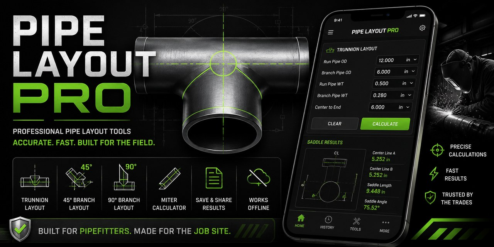
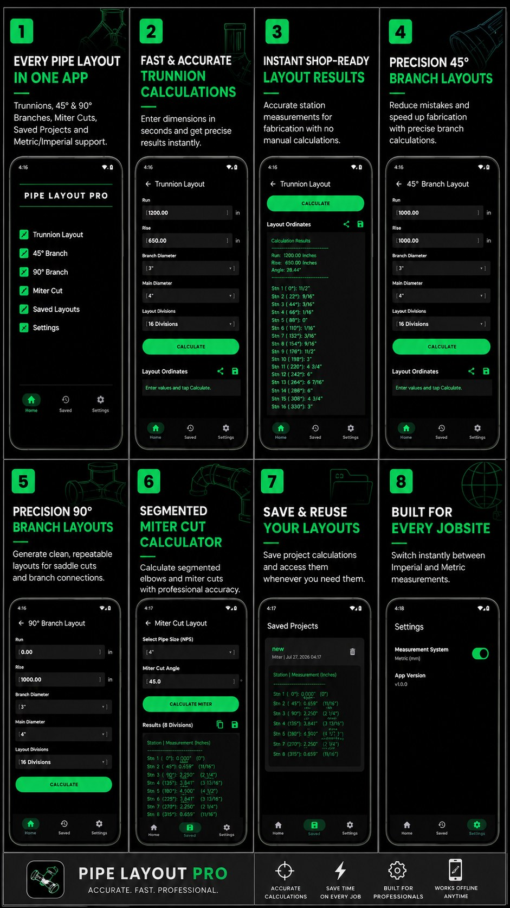

  

<h1 align="center">Pipe Layout Pro</h1>

  <strong>Professional pipe layout calculations built for the field.</strong> 
  Android tools for pipefitters, welders, fabricators, boilermakers, maintenance crews, contractors, apprentices, and journeypersons.

  <a href="https://play.google.com/store/apps/details?id=com.thatappguy.pipelayoutcalculator"><strong>▶ Get Pipe Layout Pro on Google Play</strong></a>
  &nbsp;•&nbsp;
  <a href="https://github.com/sponsors/thatappguy71"><strong>❤️ Sponsor development</strong></a>
  &nbsp;•&nbsp;
  <a href="https://github.com/thatappguy71/pipelayoutcalculator/issues">Report a bug / request a feature</a>

---

## Built by a tradesperson, for tradespeople

Pipe Layout Pro is an Android utility built around calculations used in real fabrication and pipe work. The goal is simple: make common layout work faster, clearer, and easier to carry in your pocket — without burying the job under unnecessary engineering jargon.

**Less time doing math. More time getting the layout right.**

## Core tools

| Tool | Purpose |
| --- | --- |
| **Trunnion Layout** | Generate layout measurements for trunnion connections. |
| **45° Branch Layout** | Calculate angled branch layout measurements. |
| **90° Branch Layout** | Generate repeatable 90-degree branch layouts. |
| **Miter Calculator** | Calculate miter/segmented cut measurements. |
| **Saddle Layout** | Calculate saddle layout measurements. |
| **Saved Calculations** | Save and return to previous layout work. |

### Field-friendly features

- Imperial and metric measurement support
- Works offline
- Clear calculation results
- Saved calculations/projects
- Share/save result workflows
- Dark, high-contrast interface designed for job-site use

  

## Get Pipe Layout Pro

Pipe Layout Pro is **live on Google Play** for Android.

➡️ **[Download Pipe Layout Pro on Google Play](https://play.google.com/store/apps/details?id=com.thatappguy.pipelayoutcalculator)**

The current release provides the core pipe-layout toolkit with offline operation and no subscription required. Future optional Pro functionality may add advanced tools while keeping the core app useful on its own.

## Project status and source availability

This repository is currently the public project home for Pipe Layout Pro.

The complete application source code is **not currently published in this repository**. The repo is being used for public documentation, release information, issue tracking, feature requests, and project updates.

That may change as the project evolves, but this page will always be clear about what is and is not open source.

## Feedback from the field

Real-world feedback is more useful than features invented behind a desk.

Open an issue if you have:

- A calculation you want added
- A workflow that could be faster
- A result that needs clarification
- A bug or incorrect calculation
- A device-specific problem
- A usability suggestion
- An idea that would make the app more useful in fabrication or on site

➡️ **[Open an issue](https://github.com/thatappguy71/pipelayoutcalculator/issues)**

## Roadmap

The current focus is a stable, useful v1 release and feedback from working tradespeople.

See **[ROADMAP.md](ROADMAP.md)** for the working roadmap and planned direction.

## Support independent development

Pipe Layout Pro is independently developed. Sponsorship helps cover:

- Development and testing
- Android device testing
- Google Play publishing and maintenance
- Documentation
- Bug fixes
- New calculators and layout tools
- Accessibility improvements
- Keeping useful core functionality accessible

If Pipe Layout Pro saves you time on a job, consider supporting continued development through GitHub Sponsors.

  <a href="https://github.com/sponsors/thatappguy71"><strong>❤️ Sponsor @thatappguy71</strong></a>

## Safety note

Pipe Layout Pro is a calculation and layout aid. Always verify dimensions, measurements, fabrication requirements, applicable codes, drawings, specifications, and job-site procedures before cutting, fitting, welding, or fabrication. The app is not a substitute for qualified engineering or project-specific requirements.

## About the developer

I'm an independent developer and journeyman welder building practical software around real problems I've encountered in the field and in life.

My work currently focuses on two areas:

- **Trades tools** — practical utilities such as Pipe Layout Pro.
- **Recovery technology** — accessible tools for recovery, accountability, and healthier habits.

I like software that solves an actual problem. That's what I'm trying to build here.

---

<strong>Built for the people who measure twice because cutting it three times gets expensive.</strong>

